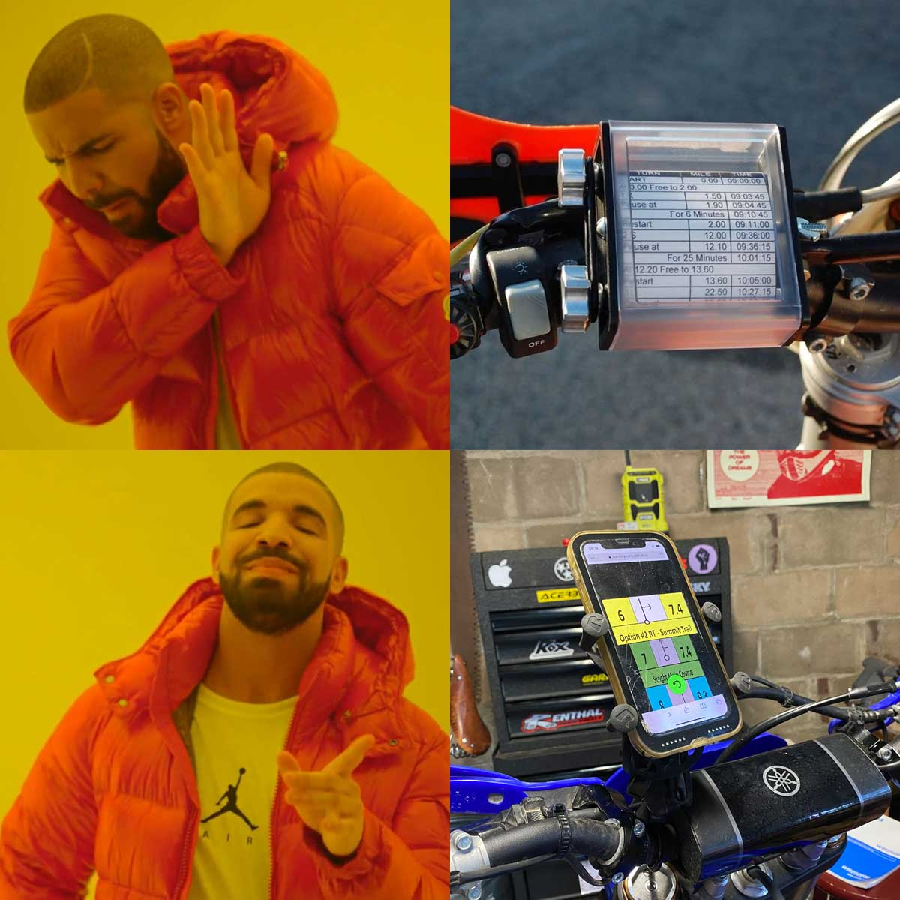

# Instructions
 1. [Visit the GitHub Pages link for this project](https://danielgivens.github.io/tapchart/) on your phone.
 2. "Add to home screen" to add as a PWA
 3. Open the app and allow it to load everything.
 4. Tap anywhere to continue as step, tap the undo button to revert a step.

# To Do
- simplify logic for image-list.js
- add loading status indicator
- add repo link to GH pages
- longterm: roll chart builder (no images)
- longterm: gps split screen
